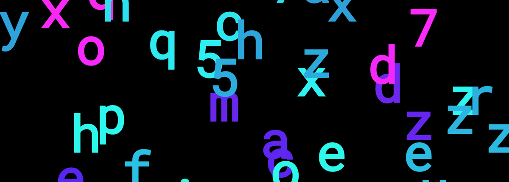

# Letters (remix)

Une version modifée du projet "Letters", créé par Nathan Meyer et [Luca Reichenbach](http://lucareichenbach.com/) dans le cadre du "Projet Canevas".

Développement de la version initiale: janvier-mars 2017.  
Développement remix: novembre 2017.

Dans le cadre de l'enseignement web & multimédia.  
Enseignant: Manuel Schmalstieg.

Eracom, Lausanne  
2017